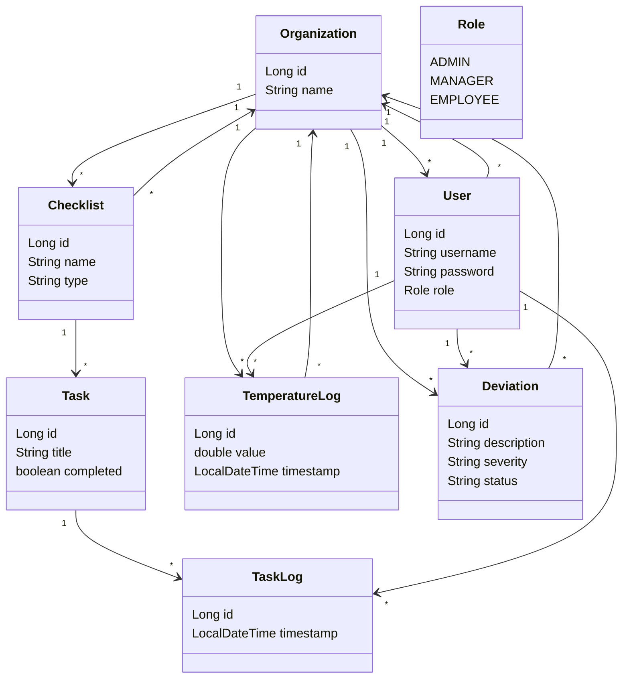

# fullstack-IDATT2105
Restaurant management application

## Backend Structure

This class diagram gives a high-level view of the backend domain model for the restaurant management system.
It shows how organizations own operational data, how users are connected to logged activity, and how checklists are structured into tasks and task history.

Key relationships:
- One `Organization` has many `User`, `Checklist`, `TemperatureLog`, and `Deviation` entries.
- One `Checklist` contains many `Task` items, and each `Task` can have multiple `TaskLog` records.
- A `User` can create many `TaskLog`, `TemperatureLog`, and `Deviation` records.

