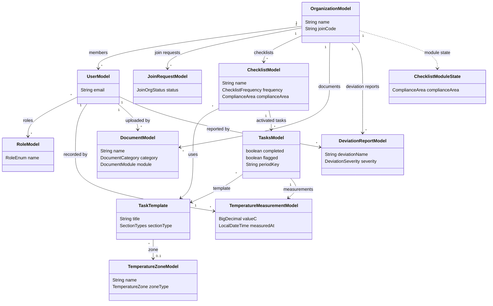

# Restaurant Management Application

A full-stack application developed to help restaurants manage daily operations, internal control routines, documentation, and team administration in one system.

## What The App Does

The application helps restaurants manage daily routines and internal control tasks in one place. Users can register, join or create a restaurant organization, complete checklists, log temperatures, manage documents, and get detailed reports on checklist completion and temperature tracking. The system is designed to support safer operations, clearer responsibilities, and better documentation of internal routines.

## Main Features

- Authentication for registering and logging in users
- Create or join a restaurant
- Role-based access control for managing permissions
- Checklist management for daily/weekly/monthly routines
- Temperature logging and compliance tracking
- Document management for storing restaurant files
- Deviation reporting for registering and following up incidents
- Reporting and dashboard views for operational insight

## Backend Structure

The backend is organized around a tenant-aware restaurant domain.
`OrganizationModel` is the core boundary for most operational data, while user access, checklist execution,
temperature logging, document storage, and deviation reporting are split into focused modules.

Key relationships:
- One `OrganizationModel` groups users, checklists, documents, deviation reports, and join requests.
- `UserModel` belongs to an organization and can hold multiple roles.
- `ChecklistModel` belongs to an organization and reuses `TaskTemplate` entries.
- `TasksModel` represents an activated checklist task for a given period.
- `TemperatureMeasurementModel` is recorded for a task by a user inside an organization.
- Some support models still store `organizationId` directly instead of a full JPA relation.

