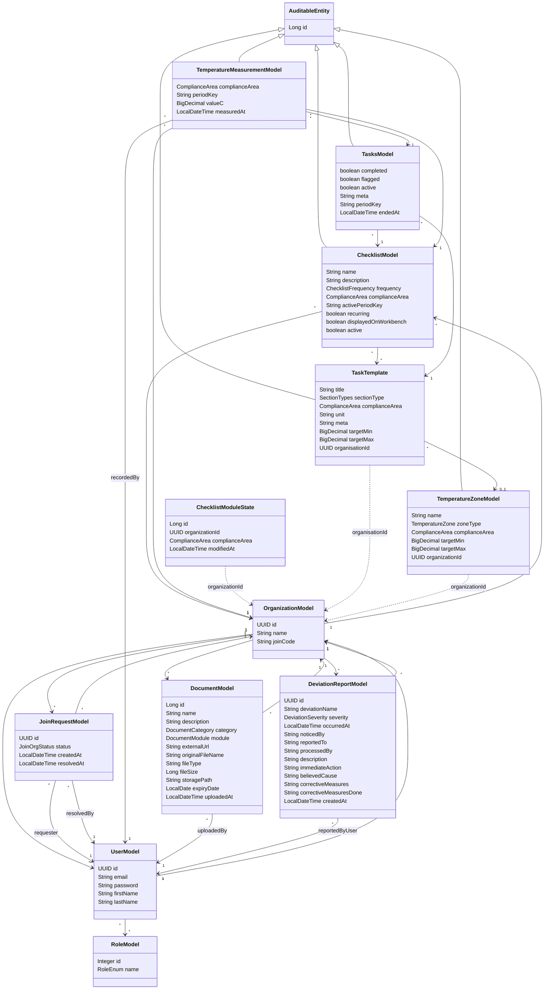

# fullstack-IDATT2105
Restaurant management application

## Backend Structure

The backend is organized around a tenant-aware restaurant domain.
`OrganizationModel` is the core boundary for most operational data, while user access, checklist execution,
temperature logging, document storage, and deviation reporting are split into focused modules.

Key relationships:
- One `OrganizationModel` can have many `UserModel`, `ChecklistModel`, `DocumentModel`, `DeviationReportModel`, and `JoinRequestModel` records.
- `UserModel` belongs to an organization and can hold many `RoleModel` entries through the `user_roles` join table.
- `ChecklistModel` belongs to an organization and is composed from reusable `TaskTemplate` entries.
- `TasksModel` represents activated checklist tasks for a specific period and links a checklist to a task template.
- `TemperatureMeasurementModel` records a measured value for an activated task, checklist, organization, and user.
- `ChecklistModuleState` and some supporting models currently store `organizationId` directly instead of a JPA relation.

