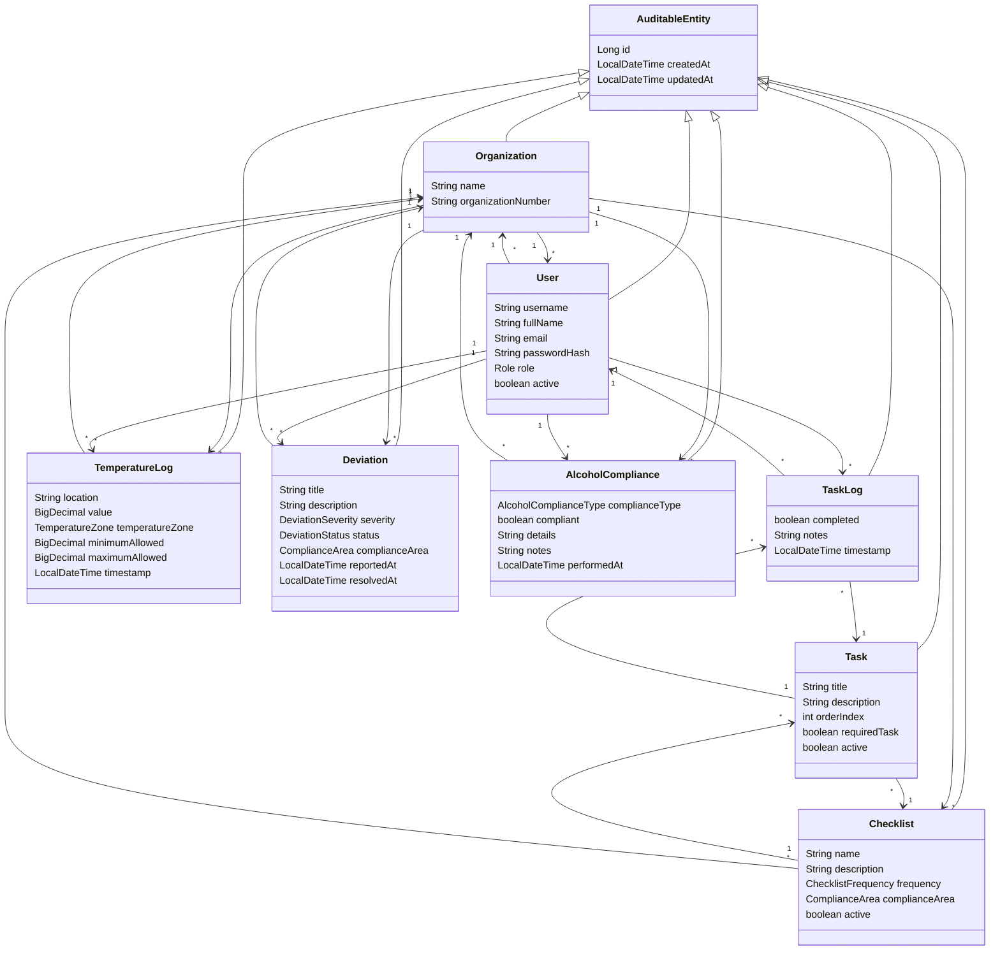

# fullstack-IDATT2105
Restaurant management application

## Backend Structure

The backend foundation is centered on a simple tenant-aware domain model.
`Organization` isolates each restaurant's data, while operational entities such as checklists, logs,
deviations, and alcohol compliance records are linked back to both the organization and the user when relevant.

Key relationships:
- One `Organization` owns many `User`, `Checklist`, `TemperatureLog`, `Deviation`, and `AlcoholCompliance` records.
- One `Checklist` contains many `Task` entries.
- One `Task` can have many `TaskLog` records.
- A `User` can create operational records such as task logs, temperature logs, deviations, and alcohol compliance entries.

